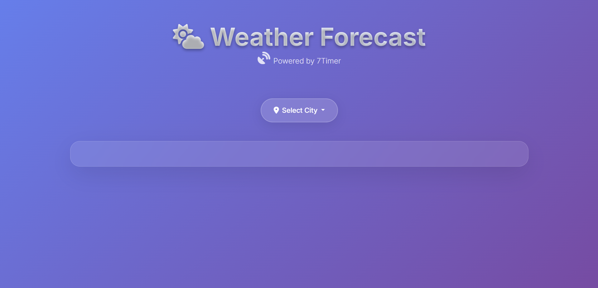
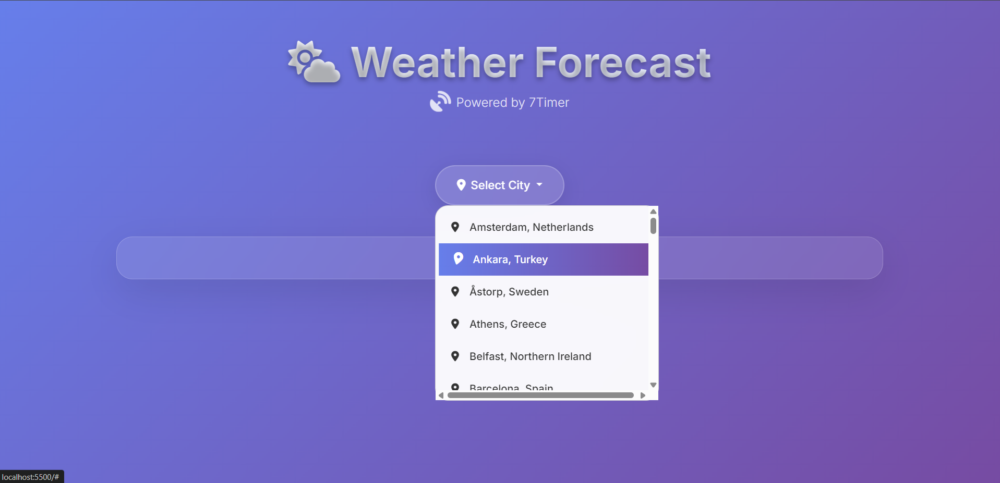
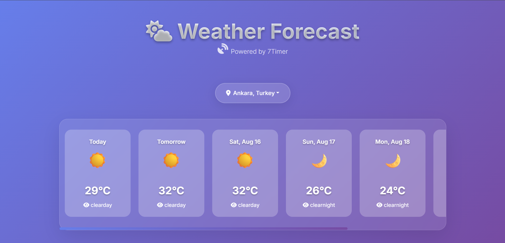
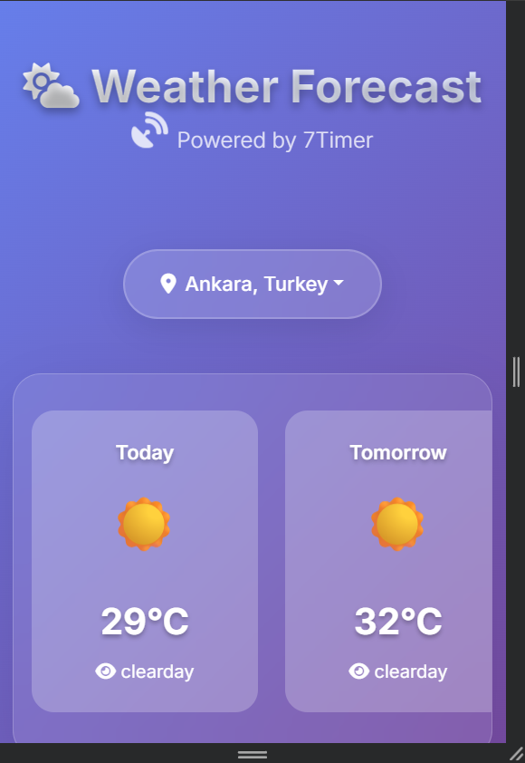

# 🌤️ Weather Forecast App

A beautiful, responsive weather forecast application that provides 7-day weather predictions for cities across Europe. Built with vanilla JavaScript, HTML5, and CSS3, featuring a modern glassmorphism design and real-time weather data from the 7Timer API.



## ✨ Features

- **🌍 Multi-City Support**: Choose from 50+ European cities including major capitals and popular destinations
- **📅 7-Day Forecast**: Get detailed weather predictions for the next week
- **🎨 Modern UI**: Beautiful glassmorphism design with smooth animations and hover effects
- **📱 Responsive Design**: Works perfectly on desktop, tablet, and mobile devices
- **🔄 Auto-Update**: Weather data automatically refreshes every 5 minutes
- **🌤️ Weather Icons**: Intuitive emoji-based weather representations
- **⚡ Real-time Data**: Powered by 7Timer API for accurate meteorological information

## 🚀 Live Demo

[View Live Demo](https://your-github-username.github.io/WeatherApp/)

## 📋 Table of Contents

- [Features](#-features)
- [Installation](#-installation)
- [Usage](#-usage)
- [Technologies Used](#-technologies-used)
- [Project Structure](#-project-structure)
- [API Integration](#-api-integration)
- [Screenshots](#-screenshots)
- [Video Demo](#-video-demo)
- [Contributing](#-contributing)
- [License](#-license)

## 🛠️ Installation

1. **Clone the repository**
   ```bash
   git clone https://github.com/your-username/WeatherApp.git
   cd WeatherApp
   ```

2. **Open the application**
   - Simply open `index.html` in your web browser
   - Or use a local server for better experience:
     ```bash
     # Using Python
     python -m http.server 8000
     
     # Using Node.js
     npx serve .
     
     # Using PHP
     php -S localhost:8000
     ```

3. **Access the app**
   - Navigate to `http://localhost:8000` in your browser

## 📖 Usage

1. **Select a City**: Click on the "Select City" dropdown button to choose from available European cities
2. **View Forecast**: The app will automatically display a 7-day weather forecast for the selected city
3. **Auto-Refresh**: Weather data updates automatically every 5 minutes
4. **Responsive Design**: The interface adapts to different screen sizes for optimal viewing

### Available Cities

The app includes weather data for 50+ European cities including:
- **Major Capitals**: London, Paris, Berlin, Rome, Madrid, Amsterdam, etc.
- **Popular Destinations**: Barcelona, Florence, Prague, Vienna, Budapest, etc.
- **Scenic Locations**: Skye (Scotland), French Riviera, Mallorca, etc.

## 🛠️ Technologies Used

- **Frontend**: HTML5, CSS3, Vanilla JavaScript
- **Styling**: Bootstrap 5.3.2, Font Awesome 6.4.0
- **Weather API**: 7Timer API
- **Design**: Glassmorphism, CSS Grid, Flexbox
- **Fonts**: Inter (Google Fonts)

## 📁 Project Structure

```
WeatherApp/
├── index.html              # Main HTML file
├── css/
│   └── master.css          # Custom styles and animations
├── js/
│   └── main.js            # JavaScript functionality
├── city_coordinates.csv    # City data with coordinates
└── README.md              # Project documentation
```

## 🔌 API Integration

The app integrates with the **7Timer API** to fetch real-time weather data:

- **Endpoint**: `https://www.7timer.info/bin/api.pl`
- **Parameters**: Latitude, longitude, product type (civil)
- **Response**: JSON format with 7-day forecast data
- **Update Frequency**: Every 5 minutes automatically

### Weather Data Includes:
- Temperature (°C)
- Weather conditions (clear, cloudy, rain, snow, etc.)
- Daily forecasts for 7 days

## 📸 Screenshots

### Main Interface

*Clean, modern interface with gradient background and glassmorphism design*

### City Selection

*Interactive dropdown with 50+ European cities*

### Weather Cards

*7-day forecast cards with weather icons and temperatures*

### Mobile Responsive

*Fully responsive design that works on all devices*

### Loading State

*Smooth loading animation while fetching weather data*

## 🎥 Video Demo

[]

**Video Features Demonstrated:**
- City selection process
- Weather data loading
- Responsive design on different screen sizes
- Smooth animations and transitions
- Auto-refresh functionality

*[Click to watch the full demo video]*

## 🎨 Design Features

### Glassmorphism Design
- Semi-transparent backgrounds with blur effects
- Subtle borders and shadows
- Modern, clean aesthetic

### Animations
- Floating weather icons
- Hover effects on cards and buttons
- Smooth transitions and transforms
- Loading spinners

### Color Scheme
- Gradient background (purple to blue)
- White text with transparency
- Consistent visual hierarchy

## 🔧 Customization

### Adding New Cities
1. Edit `city_coordinates.csv`
2. Add new rows with format: `latitude,longitude,city,country`
3. Save and refresh the application

### Styling Changes
- Modify `css/master.css` for visual updates
- Adjust colors, fonts, and animations
- Customize card layouts and spacing

### API Configuration
- Update API endpoint in `js/main.js`
- Modify update frequency (currently 5 minutes)
- Add additional weather parameters

## 🤝 Contributing

Contributions are welcome! Please feel free to submit a Pull Request.

1. Fork the repository
2. Create your feature branch (`git checkout -b feature/AmazingFeature`)
3. Commit your changes (`git commit -m 'Add some AmazingFeature'`)
4. Push to the branch (`git push origin feature/AmazingFeature`)
5. Open a Pull Request

## 📝 License

This project is licensed under the MIT License - see the [LICENSE](LICENSE) file for details.

## 🙏 Acknowledgments

- **7Timer API** for providing weather data
- **Bootstrap** for responsive framework
- **Font Awesome** for beautiful icons
- **Google Fonts** for typography

## 📞 Contact

- **GitHub**: [@your-username](https://github.com/your-username)
- **Email**: your.email@example.com
- **Project Link**: [https://github.com/your-username/WeatherApp](https://github.com/your-username/WeatherApp)

---

⭐ **Star this repository if you found it helpful!**
